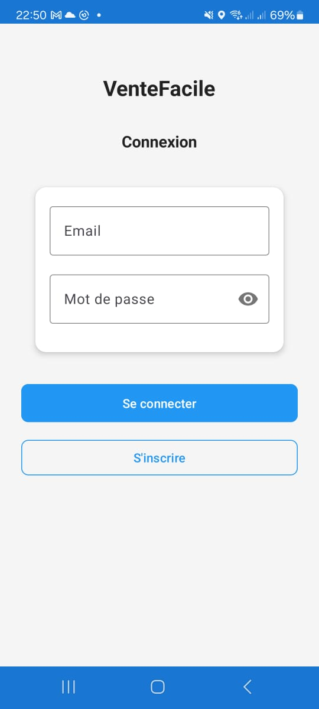
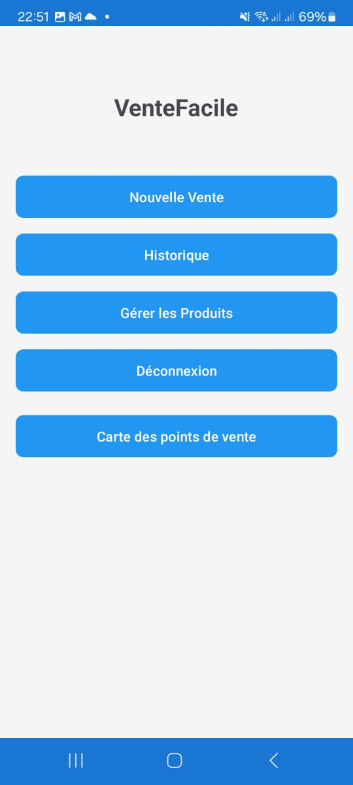
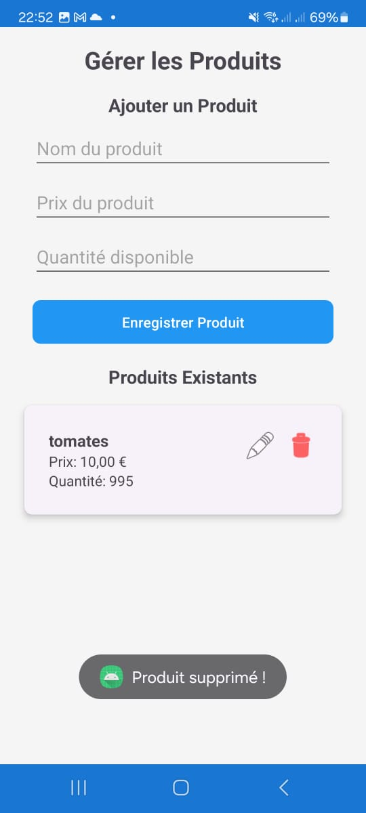
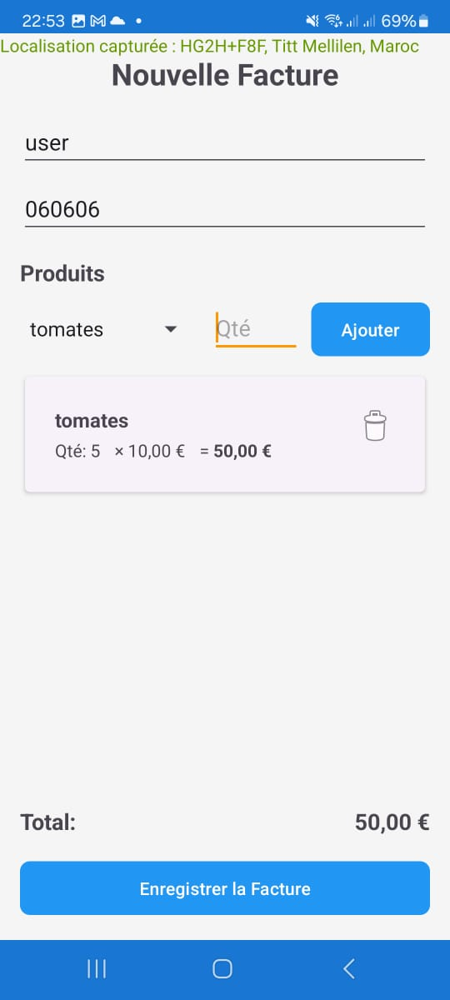
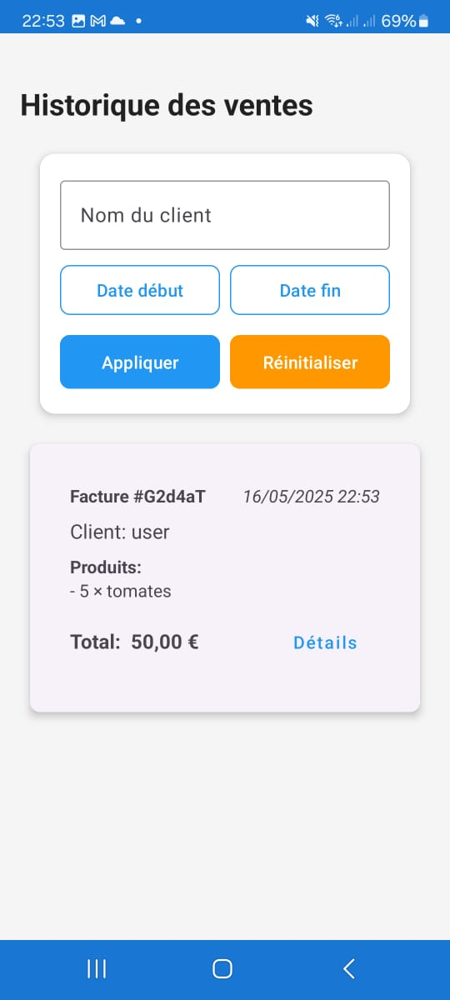
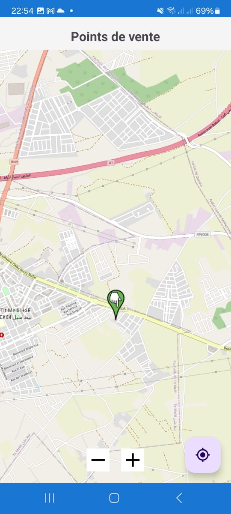

# Easy Sales

Android application for easily managing your sales, products, and invoices.

## 📱 About the Application

Easy Sales is a complete mobile solution for merchants and entrepreneurs who want to manage their daily sales. The application allows you to manage product inventory, create invoices, track sales history, and visualize sales locations on a map.

## ✨ Key Features

- **Product Management**: Add, edit, and delete products with inventory tracking
- **Invoice Creation**: Intuitive interface for creating invoices with multiple products
- **Sales History**: View and filter transaction history
- **Sales Map**: Geographic visualization of sales locations with OpenStreetMap
- **Authentication**: Secure login and registration system with Firebase
- **Data Storage**: Data stored on Firebase Realtime Database

## 📸 Screenshots

<div align="center">
  <table>
    <tr>
      <td align="center"><b>Login Screen</b></td>
      <td align="center"><b>Main Dashboard</b></td>
      <td align="center"><b>Product Management</b></td>
    </tr>
    <tr>
      <td></td>
      <td></td>
      <td></td>
    </tr>
    <tr>
      <td align="center"><b>Invoice Creation</b></td>
      <td align="center"><b>Sales History</b></td>
      <td align="center"><b>Sales Map</b></td>
    </tr>
    <tr>
      <td></td>
      <td></td>
      <td></td>
    </tr>
  </table>
</div>

## 🛠️ Technologies Used

- Java
- Firebase (Authentication, Realtime Database)
- OpenStreetMap for mapping
- Material Design Components
- ViewBinding for user interface

## 📋 Prerequisites

- Android Studio
- Android SDK 21 or higher
- Firebase account
- Internet connection for full functionality

## 🚀 Installation

1. Clone this repository
```bash
git clone https://github.com/ismail-elaziz/Easy-Sales.git
```

2. Open the project in Android Studio

3. Connect the application to your Firebase project:
   - Create a project in Firebase console
   - Add an Android app with the package `com.example.projetandroid`
   - Download the `google-services.json` file and place it in the `app/` folder
   - Sync the project with Gradle

4. Run the application on an emulator or physical device

## 📊 Project Structure

```
app/
├── java/
│   └── com/
│       └── example/
│           └── projetandroid/
│               ├── adapters/    # Adapters for RecyclerViews
│               ├── model/       # Data model classes (Product, Invoice, etc.)
│               ├── view/        # Activities and fragments for user interface
│               └── utils/       # Utility classes
└── res/
    ├── layout/                  # XML layout files
    ├── drawable/                # Images and icons
    ├── values/                  # Strings, dimensions, colors, styles
    └── ...
```

## 📝 Todo

- [ ] Add statistics and charts
- [ ] Implement PDF report generation
- [ ] Add support for online payments
- [ ] Offline synchronization


## 👤 Author

**ISMAIL ELAZIZ**
- GitHub: [@ismail-elaziz](https://github.com/ismail-elaziz)
- LinkedIn: [Ismail El Aziz](https://www.linkedin.com/in/ismailelaziz/)

---


